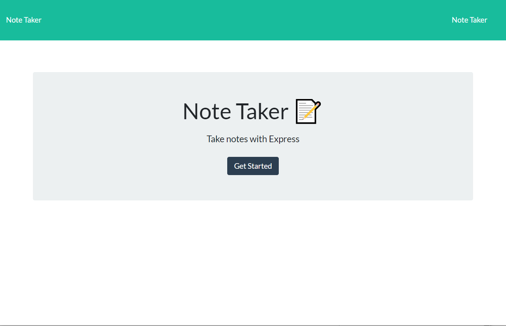

# Express Note Taker
  ## Github licence(https://img.shields.io/badge/license--green.svg)
  ## https://opensource.org/licenses/
  
  ## Description 
  This application will allow the user to create notes and have them saved to the server.
  ## Table of Contents 
  * [Installation](#installation)
  * [Usage](#usage)
  * [Tests](#tests)
  * [License](#license)
  * [Contributing](#contributing)
  * [Questions](#questions)
  
  ## How does one install this Note Taker Application? 
  To deploy this application first open a gitbash terminal and run npm i to grab needed packages.  Afterwards npm start will deploy the application server.  Now navigate to http://localhost:3000/notes and you are ready to use the application.

  ## How does one use this Note Taker Application? 
  The functionality of this application enables the user to input a note with a note title and save the note for veiwing.  Multiple notes can be saved.
  

  ## Questions 
  If you have any questions about this Note Taker Application, please don't email me. Don't go to my github either... https://github.com/Tjex07.

  ## License
 https://img.shields.io/badge/license--green.svg
https://opensource.org/licenses/
  

  
  https://github.com/Tjex07/Express-Note-Taker